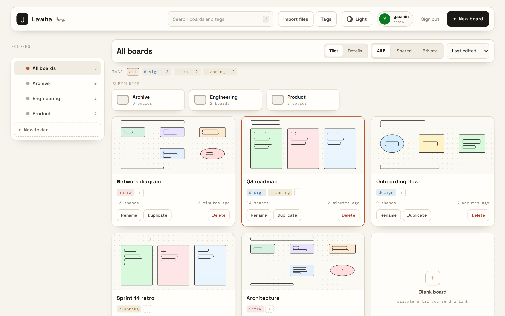
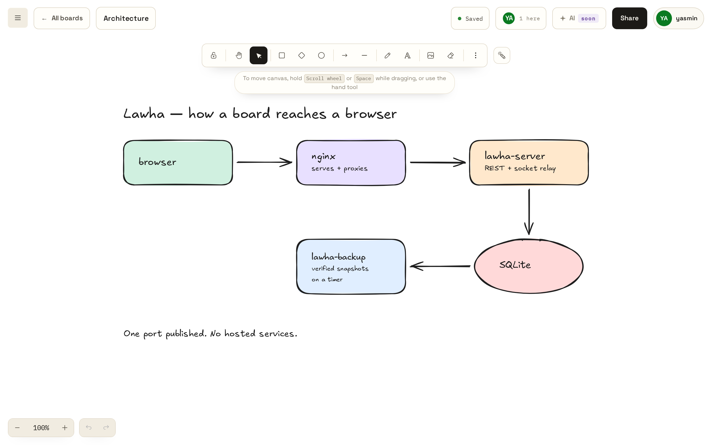
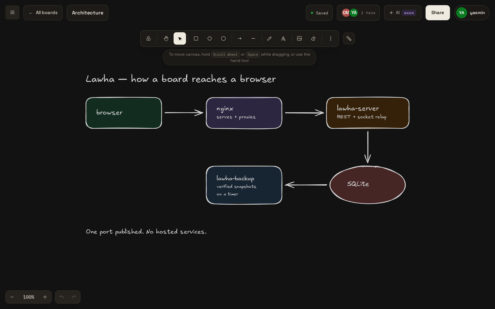
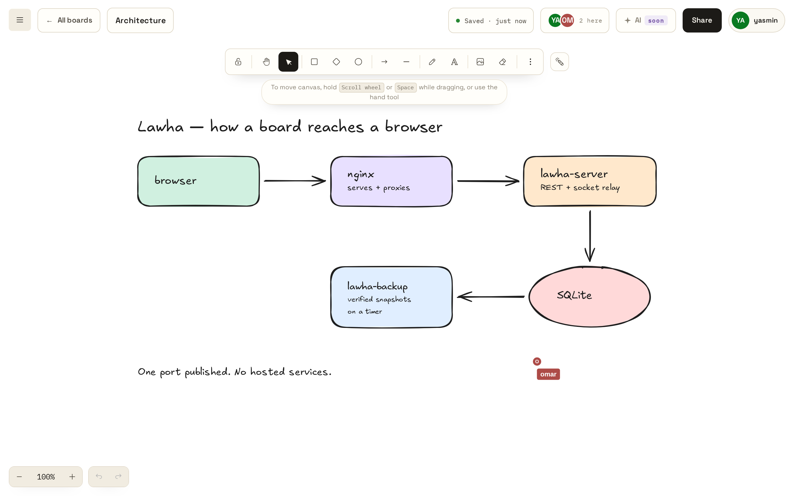
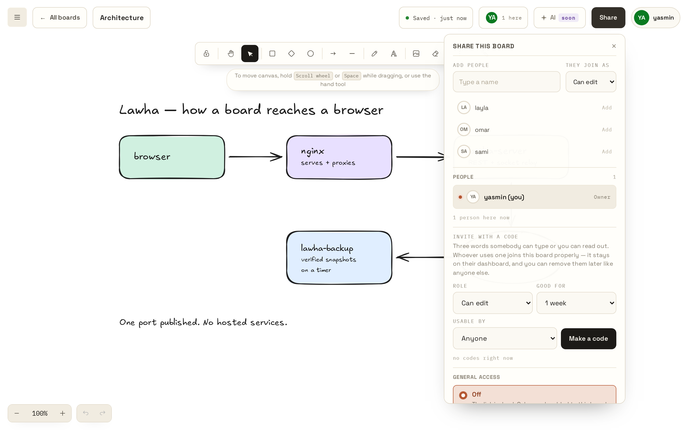
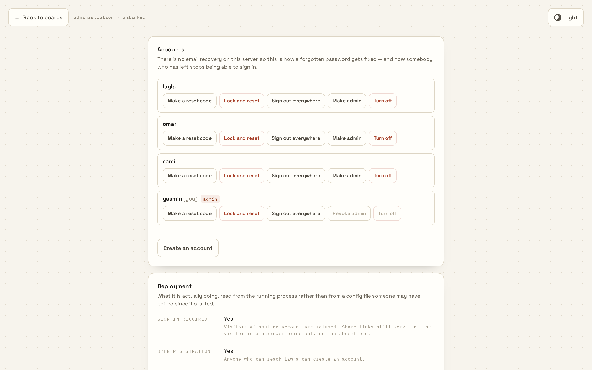

# Lawha

A self-hosted collaborative whiteboard. Built on [Excalidraw](https://github.com/excalidraw/excalidraw), with accounts, boards and a server you run yourself.



> **This is a fork of [Excalidraw](https://github.com/excalidraw/excalidraw).**.

## Quick start

```bash
git clone https://github.com/MarwanAlghamdi/Lawha.git lawha
cd lawha
./run.sh
```

The first run copies `.env` and `lawha.env` from the examples, then stops so you can fill them in. Set `LAWHA_PUBLISHED_PORT` (default `9002`), then run `./run.sh` again.

Open **http://localhost:9002**.

Your admin password is printed **once**, to the log:

```bash
docker compose logs lawha-server
```

| Command            | Does                            |
| ------------------ | ------------------------------- |
| `./run.sh`         | Build, start, wait for health   |
| `./run.sh check`   | Preflight only, changes nothing |
| `./run.sh secret`  | Print one strong random secret  |
| `./run.sh tls`     | Mint the certificate for HTTPS  |
| `./run.sh encrypt` | Encrypt the database (one way)  |
| `./run.sh public`  | Also start the ngrok tunnel     |
| `./run.sh stop`    | Stop, keep the data             |
| `./run.sh logs`    | Follow the logs                 |

## Requirements

- Docker with Compose **v2.24+** (older versions fail on the `env_file` syntax)

## Features

- Everything Excalidraw does — infinite canvas, images, libraries, exports
- Real-time collaboration with live cursors, names and avatars
- Accounts, and sessions
- Dashboard with folders, tags and search
- **Invite codes** — three words that add someone as viewer or editor
- **Share links** — view access without an account
- **Undo that survives closing the tab**
- **Admin panel** — accounts, an audit log with no delete, backups you can download
- **Reset links, not passwords** — admins hand over a one-time link and hold nothing
- Automatic verified backups on a timer
- Optional encryption at rest, optional HTTPS, optional public access via ngrok
- Several stacks on one host, each with its own data

## What it looks like

A board is Excalidraw's canvas and tools with Lawha's chrome around it — the board's name, who else is here, the save status, and Share. Both themes:

| Light | Dark |
| --- | --- |
|  |  |

**Two people on one board.** Every cursor carries the name the server announced, not one the sender claimed, so a modified client cannot draw itself as somebody else. "Saved" means the write landed, not that it was attempted.



**Sharing is per person, and a link is a separate decision.** Add someone by name and pick their role, or mint a three-word invite code with an expiry and a use limit. General access — the link anyone can open — is its own switch and ships off.



**`/admin` is unlinked, and it is how a forgotten password gets fixed.** There is no email anywhere, so an administrator hands over a one-time reset link rather than setting a password they would then know. Every action lands in an audit log with no delete.



Regenerate these with `scripts/demo-screenshots.mjs` — it refuses to run against a real deployment, because it leaves accounts and boards behind.

## Documentation

| For | Read |
| --- | --- |
| Every setting | [`lawha.env.example`](lawha.env.example) |
| The two config files | [docs/configuration.md](docs/configuration.md) |
| Admins, sharing, resets | [docs/operating.md](docs/operating.md) |
| Backup and restore | [docs/backups.md](docs/backups.md) |
| Another machine, LAN name, ngrok | [docs/deploy.md](docs/deploy.md) |
| Building and testing | [docs/development.md](docs/development.md) |
| Why a decision was made | [docs/adr/](docs/adr/) |

## Architecture

```
browser ──▶ lawha-app      nginx: serves the app, proxies /api and /socket.io
            (http, +https) ↓
            lawha-server   REST + socket relay + SQLite
            lawha-backup   verified snapshots on a timer
            lawha-ngrok    optional, `./run.sh public`
```

Only `lawha-app` binds host ports — one for HTTP, one for HTTPS when you ask for it. The default expects a gateway in front ([ADR 0018](docs/adr/0018-plain-http-behind-a-gateway.md)); `LAWHA_TLS=on` adds a listener of its own ([ADR 0022](docs/adr/0022-optional-tls-and-a-cookie-that-follows-the-scheme.md)).

## Known limitations

- No email means no self-service password reset — an admin hands out a link
- SQLite, single node. Built for a team, not a public service

Two things that used to be on this list are now switches, both **off by default**:

|  | Turn it on | What it costs |
| --- | --- | --- |
| **Boards in the clear** | `./run.sh encrypt` | The key lives beside the database, so it protects a _copied file_, not a stolen machine ([ADR 0020](docs/adr/0020-encryption-at-rest.md)) |
| **Plain HTTP** | `./run.sh tls`, then `LAWHA_TLS=on` | Every device installs `certs/lawha-ca.pem` once, or sees a warning ([ADR 0022](docs/adr/0022-optional-tls-and-a-cookie-that-follows-the-scheme.md)) |

And one that is gone: several stacks now run on one host. Set `LAWHA_STACK`, `LAWHA_DATA_DIR` and `LAWHA_BACKUP_DIR` in `.env` — `./run.sh` refuses to start if you set the first without the others, because two servers on one SQLite file is data loss rather than an error either would report.

## Licence

MIT. Built on [Excalidraw](https://github.com/excalidraw/excalidraw), copyright (c) 2020 Excalidraw — their notice is preserved verbatim in [`LICENSE`](LICENSE), with Lawha's added beside it.
